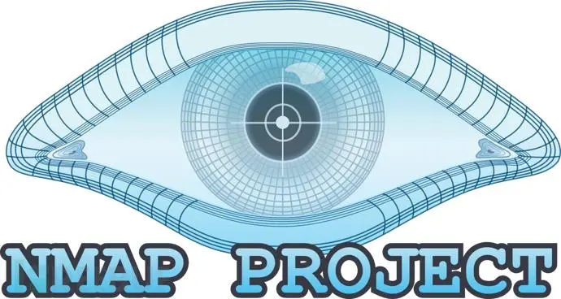

* [国家网络安全法]()
	* [ 国家网络安全法介绍和案例](首页.md)
		
* [Kali_Linux命令合集](Kali_Linux命令合集/Kali_Linux命令合集.md)

* [渗透测试系统Kali_Linux](渗透测试系统Kali_Linux/Kali_Linux/Kali_Linux.md)
	* [ Kali_Linux](渗透测试系统Kali_Linux/Kali_Linux/Kali_Linux.md)
		* [导读•什么是安全渗透](渗透测试系统Kali_Linux/Kali_Linux/导读•什么是安全渗透.md)
		* [安全渗透所需的工具](渗透测试系统Kali_Linux/Kali_Linux/安全渗透所需的工具.md)
		* [一、Kali_Linux简介](渗透测试系统Kali_Linux/Kali_Linux/一、Kali_Linux简介.md)
		* [二、Kali_Linux系统配置](渗透测试系统Kali_Linux/Kali_Linux/二、Kali_Linux系统配置.md)
		* [三、配置本地网络并实现xshell连接kali系统](渗透测试系统Kali_Linux/Kali_Linux/三、配置本地网络并实现xshell连接kali系统.md)
		
	* [利用第三方服务对目标进行被动信息收集防止被发现](渗透测试系统Kali_Linux/利用第三方服务对目标进行被动信息收集防止被发现/利用第三方服务对目标进行被动信息收集防止被发现.md)
		
	* [ Maltego](渗透测试系统Kali_Linux/Maltego/Maltego.md)
		* [使用Maltego收集子域名信息](渗透测试系统Kali_Linux/Maltego/使用Maltego收集子域名信息.md)

	* [ FOFA](渗透测试系统Kali_Linux/FOFA/FOFA.md)
		* [使用资产检索FOFA搜索引擎收集信息](渗透测试系统Kali_Linux/FOFA/使用资产检索FOFA搜索引擎收集信息.md)

	* [主动信息收集](渗透测试系统Kali_Linux/主动信息收集/主动信息收集.md)

	* [基于ping命令的探测](渗透测试系统Kali_Linux/基于ping命令的探测/基于ping命令的探测.md)

	* [ Nmap](渗透测试系统Kali_Linux/Nmap/Nmap.md)
		* [基于Nmap的扫描方式](渗透测试系统Kali_Linux/Nmap/基于Nmap的扫描方式.md)
		* [NMAP高级使用技巧](渗透测试系统Kali_Linux/Nmap/NMAP高级使用技巧.md)
		* [图形界面zenmap的使用](渗透测试系统Kali_Linux/Nmap/图形界面zenmap的使用.md)
		* [实战DNMAP分布式集群执行大量扫描任务](渗透测试系统Kali_Linux/Nmap/实战DNMAP分布式集群执行大量扫描任务.md)

	* [ netcat](渗透测试系统Kali_Linux/netcat/netcat.md)
		* [使用nc扫描端口](渗透测试系统Kali_Linux/netcat/使用nc扫描端口.md)

	* [ Scapy](渗透测试系统Kali_Linux/Scapy/Scapy.md)
		* [实战-使用scapy定制数据包进行高级扫描](渗透测试系统Kali_Linux/Scapy/实战-使用scapy定制数据包进行高级扫描.md)

	* [僵尸扫描](渗透测试系统Kali_Linux/实战-僵尸扫描/僵尸扫描.md)

	* [ WireShark](渗透测试系统Kali_Linux/WireShark/WireShark.md)
		* [WireShark简介和抓包原理及过程](渗透测试系统Kali_Linux/WireShark/WireShark简介和抓包原理及过程.md)
		* [实战：WireShark抓包及快速定位数据包技巧](渗透测试系统Kali_Linux/WireShark/实战：WireShark抓包及快速定位数据包技巧.md)
		* [实战：使用WireShark对常用协议抓包并分析原理](渗透测试系统Kali_Linux/WireShark/实战：使用WireShark对常用协议抓包并分析原理.md)
		* [实战：WireShark抓包解决服务器被黑上不了网](渗透测试系统Kali_Linux/WireShark/实战：WireShark抓包解决服务器被黑上不了网.md)
		
	* [ NESSUS](渗透测试系统Kali_Linux/NESSUS/NESSUS.md)
		* [NESSUS安装配置](渗透测试系统Kali_Linux/NESSUS/NESSUS安装配置.md)