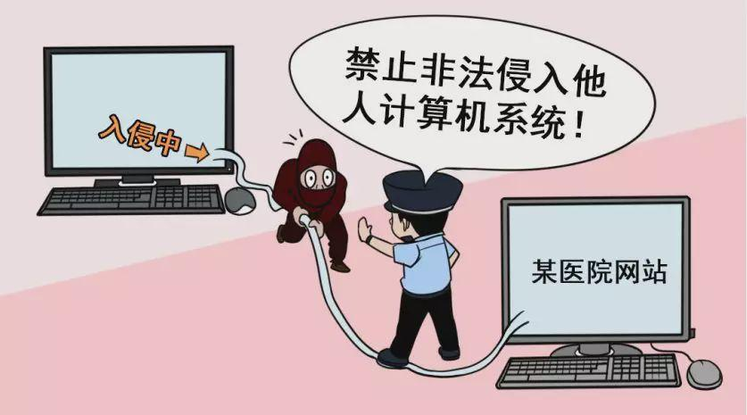
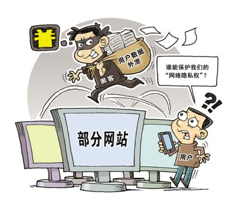
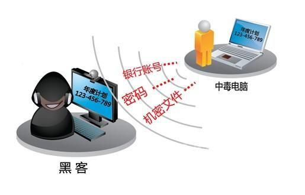

 

## 导读：
法律就是秩序，有好的法律才有好的秩序——亚里士多德

中国工程院院士李建成教授指出，“网络安全建设，应当以法律为根，技术为基。”《网络安全法》是在吸取国内外立法经验的基础上，经过多次公开征集意见，人大常委会三次审议之后完成的。尽管立法过程历时较短，但其中不乏制度亮点。

### 专用词解释：

> 1. **网络**：是指由计算机或者其他信息终端及相关设备组成的按照一定的规则和程序对信息进行收集、存储、传输、交换、处理的系统。
>
> 2. **网络安全**：是指通过采取必要措施，防范对网络的攻击、侵入、干扰、破坏和非法使用以及意外事故，使网络处于稳定可靠运行的状态，以及保障网络数据的完整性、保密性、可用性的能力。
> 
> 3. **网络运营者**：是指网络的所有者、管理者和网络服务提供者。
>
> 4. **网络数据**：是指通过网络收集、存储、传输、处理和产生的各种电子数据。
>
> 5. **个人信息**：是指以电子或者其他方式记录的能够单独或者与其他信息结合识别自然人个人身份的各种信息，包括但不限于自然人的姓名、出生日期、身份证件号码、个人生物识别信息、住址、电话号码等。

## 一、黑客违法判刑标准

> 《刑法》第二百八十五条

> 【**非法侵入计算机信息系统罪；非法获取计算机信息系统数据、非法控制计算机信息系统罪**】 
> 
> - **违反国家规定，侵入国家事务、国防建设、尖端科学技术领域的计算机信息系统的，处三年以下有期徒刑或者拘役。** 
> 
> - **违反国家规定，侵入前款规定以外的计算机信息系统或者采用其他技术手段，获取该计算机信息系统中存储、处理或者传输的数据，或者对该计算机信息系统实施非法控制，情节严重的，处三年以下有期徒刑或者拘役，并处或者单处罚金；情节特别严重的，处三年以上七年以下有期徒刑，并处罚金。**

> 第二百八十六条

> - **违反国家规定，对计算机信息系统功能进行删除、修改、增加、干扰，造成计算机信息系统不能正常运行，后果严重的，处五年以下有期徒刑或者拘役；后果特别严重的，处五年以上有期徒刑。** 
> 
> - **违反国家规定，对计算机信息系统中存储、处理或者传输的数据和应用程序进行删除、修改、增加的操作，后果严重的，依照前款的规定处罚。** 
> 
> - **故意制作、传播计算机病毒等破坏性程序，影响计算机系统正常运行，后果严重的，依照第一款的规定处罚。**

> [!warning|style:flat]
> 注：以上刑法提醒我们在做渗透测试的时候，一定要记得先取得甲方的同意书（授权书），渗透测试的手法如同黑客攻击，在未获取甲方正式授权前，千万不要擅自进行测试操作，以免触犯以上《中华人民共和国刑法》。有关的同意书（或授权书）必须经过双方法人签署，这是经过系统拥有者同意的授权书，也是我们进行合法渗透测试的法律文件。 
不过要提醒的是，特别要注意同意授权书的有效范围，不是有了授权书就可以肆意妄为，它只是渗透测试计划书所有规范的界定范围内有效，如果涉及界定范围之外的活动（包括系统、手段、工具等），则都必须重新获取授权。

## 二 、网络安全法条规细则

> 1. **个人发现网络运营者违反法律、行政法规的规定或者双方的约定收集、使用其个人信息的，有权要求网络运营者删除其个人信息；发现网络运营者收集、存储的其个人信息有错误的，有权要求网络运营者予以更正。网络运营者应当采取措施予以删除或者更正。**
> 
> 2. **任何个人和组织不得窃取或者以其他非法方式获取个人信息，不得非法出售或者非法向他人提供个人信息。**
> 
> 3. **依法负有网络安全监督管理职责的部门及其工作人员，必须对在履行职责中知悉的个人信息、隐私和商业秘密严格保密，不得泄露、出售或者非法向他人提供。**
> 
> 4. **任何个人和组织应当对其使用网络的行为负责，不得设立用于实施诈骗，传授犯罪方法，制作或者销售违禁物品、管制物品等违法犯罪活动的网站、通讯群组，不得利用网络发布涉及实施诈骗，制作或者销售违禁物品、管制物品以及其他违法犯罪活动的信息。**
> 
> 5. **任何个人和组织发送的电子信息、提供的应用软件，不得设置恶意程序，不得含有法律、行政法规禁止发布或者传输的信息。**

## 三 、网络安全的违法案例

据CNCERT抽样监测发现，2019年前4个月我境内被篡改的网站8,213个，同比增长48.8%；被植入后门的网站10,010个，同比增长22.5%。同时，近期发现由于运营者安全配置不当，很多数据库直接暴露在互联网上，导致大量用户个人信息泄露。造成这些事件很大原因是一些互联网网站运营者网络安全意识不强，特别是中小网站安全管理和防护能力较低，缺乏有效安全保障措施，成为网络攻击的重点目标和主要入口。

在信息安全的防护下也出现了很多的案例：

案例1：魏某将事先修改过回收地址的某软件通过上传至全球知名中文IT技术交流平台网站以及在其管理的QQ群内对外发布，利用他人下载使用该软件时非法获取了一万余条网站后门漏洞信息，后通过租赁上述信息非法获利人民币1.1万元。经远程勘验该1万余条网站漏洞信息中可直连被入侵互联网服务器获取控制权限的达103台。

法院经审理认为，被告人魏某违反国家规定，对国家事务、国防建设、尖端科学以外的计算机信息系统实施非法控制，情节特别严重，其行为已构成非法控制计算机信息系统罪。同时考虑到其具有坦白、退出违法所得、自愿认罪认罚等量刑情节，根据《中华人民共和国刑法》及相关司法解释的规定，判决被告人魏某犯非法控制计算机信息系统罪，判处有期徒刑三年，缓刑四年，并处罚金人民币一万五千元。

 

案例2：2015年7月8日，江苏省南通市通州区教育技术装备室负责人报案称，今年以来通州区教育党建人事网页面多次被人恶意篡改，给教育部门形象造成恶劣影响。接报警后，南通公安机关迅速勘验发现，通州区教育党建人事网服务器已被植入恶意木马程序。

近日，江苏南通公安机关成功抓获非法侵入通州区教育局网站服务器，非法篡改网页的犯罪嫌疑人丛某。经审讯，丛某对其犯罪事实供认不讳。据交代,2014年以来,丛某采用扫描网站漏洞放置木马病毒的方式获取网站控制权限，然后入侵网站服务器进行篡改，非法添加私服推广广告网页获取推广费。据统计，丛某先后入侵近200个网站，非法获利近20万元。

 

案例3：汤某通过QQ群从他人处获得某网络游戏的网站源码，并在网络上搭建钓鱼网站后以每日人民币30元至50元不等的价格出租给他人以用于窃取游戏账号及密码，共计获利8千元。被告人熊某等13人从被告人汤某处租得钓鱼网站后，窃取他人游戏账号及密码予以出售，或从他人处购买游戏账号及密码后将游戏内虚拟物品予以出售牟利。被告人晁某、王某明知是非法获取所得的游戏虚拟物品，仍予以收购。

法院经审理认为,被告人汤某、熊某等14人违反国家规定，侵入计算机信息系统，获取计算机信息系统中存储、处理或者传输的数据，其行为均已构成非法获取计算机信息系统数据罪。被告人晁某、王某明知是非法获取计算机信息系统数据犯罪所获取的数据，仍予以收购，其行为均已构成掩饰、隐瞒犯罪所得罪。对以上被告人分别以非法获取计算机信息系统数据罪、掩饰、隐瞒犯罪所得罪判处缓刑，并处罚金，或单处罚金。其中被告人陈某曾因犯非法获取计算机信息系统数据罪，仍在缓刑考验期限内，故撤销其缓刑，决定执行有期徒刑一年二个月，并处罚金人民币二万二千元。

 

案例4：张某、韦某为拓展其经营的某信息咨询公司的客户源，通过微信联系卖家，以人民币400元的价格，非法购买公民个人信息（姓名、电话号码）10000条，并进行电话营销。张某为拓展客户源，还通过购买某论坛账号等方式非法在互联网上下载公民个人信息并进行电话营销。

法院经审理认为，张某、韦某以其他方法非法获取公民个人信息，其行为均已构成侵犯公民个人信息罪。判处被告人张某有期徒刑一年，并处罚金人民币二万元；判处被告人韦某有期徒刑六个月，缓刑一年，并处罚金人民币一万元。

 

案例5： 近日，经南平市延平区检察院提起公诉，延平区法院以非法控制计算机信息系统罪判处被告人林某某有期徒刑四年三个月，并处罚金人民币80000元，判处被告人凌某有期徒刑三年，并处罚金人民币50000元；该案系南平市首例利用webshell非法控制计算机信息系统案件。

 

